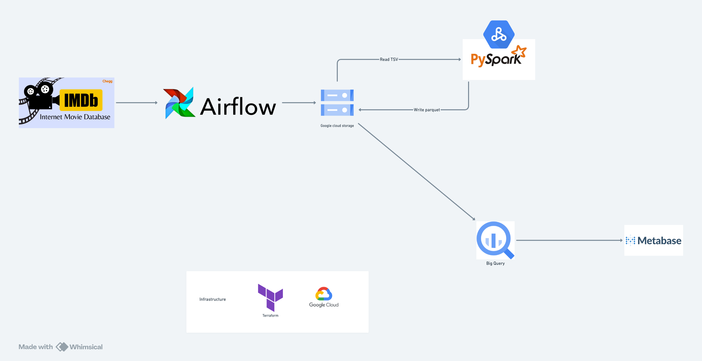
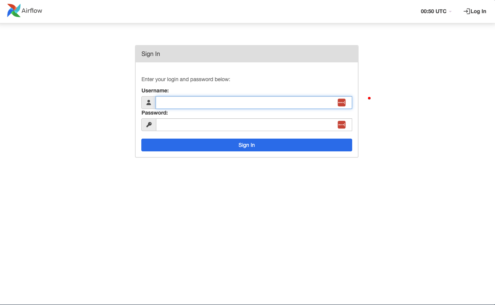
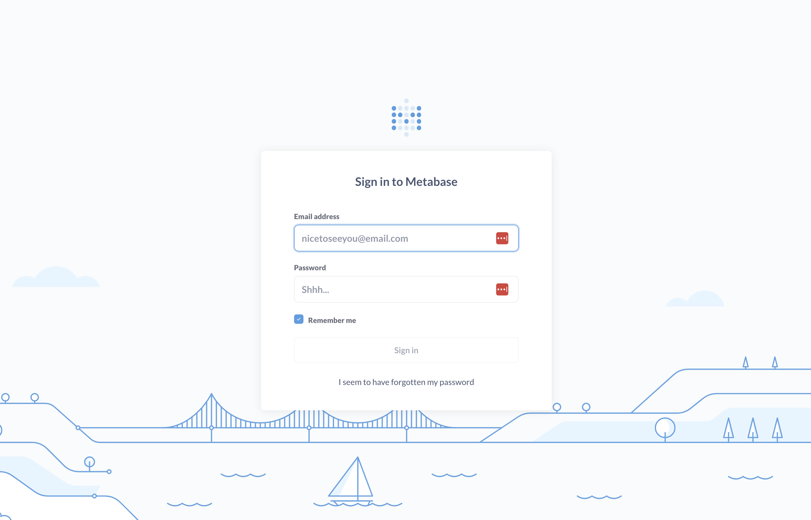
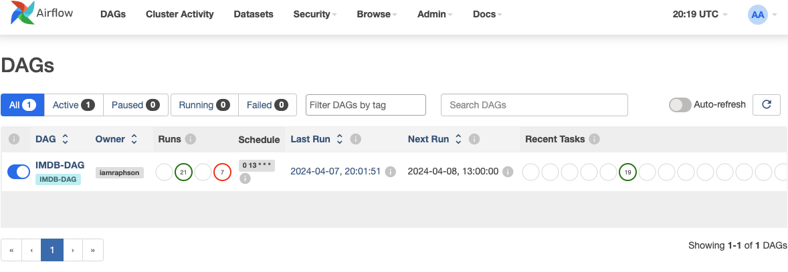
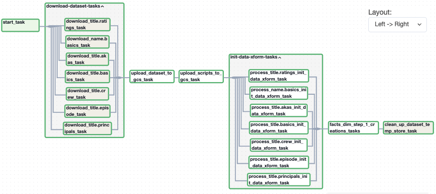
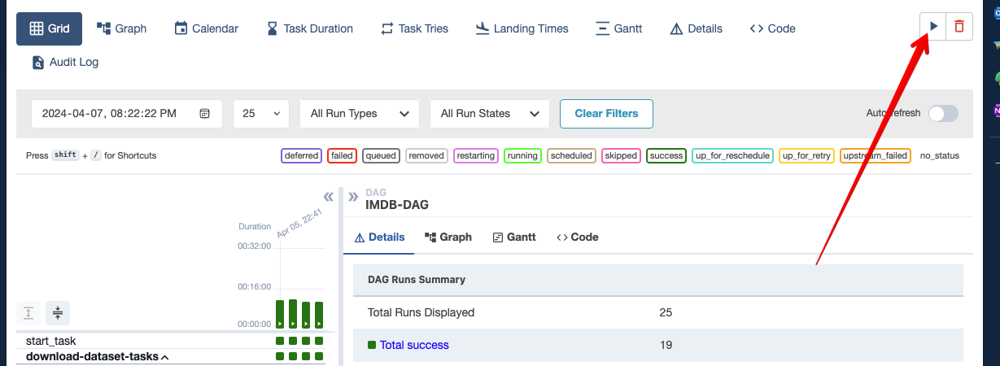
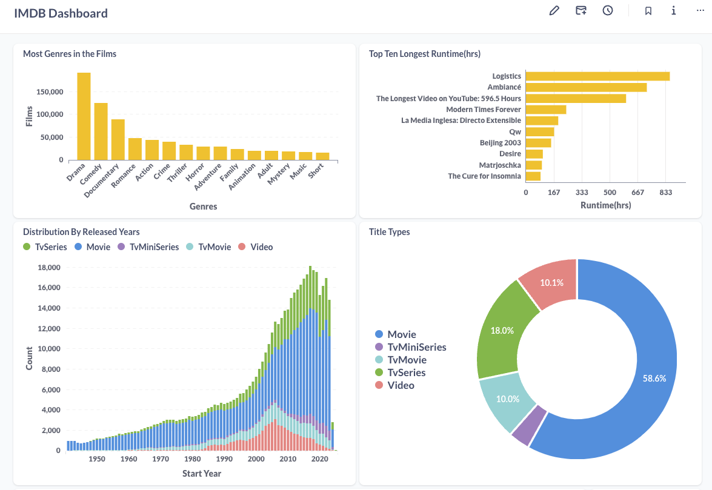
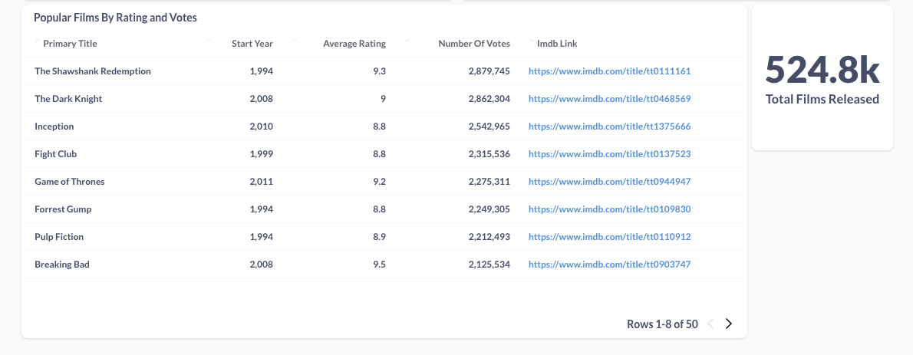

# Pipeline for IMDB Movies and Ratings on GCP

This marks the second project within the [Data Engineering Zoomcamp curriculum](https://datatalks.club/). In this project, we'll demonstrate a pipeline designed to handle batch processing of data sourced from [IMDb Non-Commercial Datasets](https://developer.imdb.com/non-commercial-datasets/).

[IMDb](https://imdb.com/), aka Internet Movie Database, serves as an extensive online repository of data concerning movies, TV shows, and video games. It encompasses a comprehensive array of details, including cast and crew information, plot summaries, ratings, and reviews, rendering it an indispensable resource for both movie enthusiasts and professionals in the industry.

Our primary objective is to establish a robust data pipeline that retrieves raw data from the IMDB dataset, stores it, enhances its quality, and presents it in an intuitive dashboard. This pipeline enables us to address various inquiries, such as the distribution of films across genres, the duration of the longest movie in hours, the proportion of films within different categories, the total count of movies in the database, and the distribution of films by release years, among others.

As per the [IMDB data specifications](https://developer.imdb.com/non-commercial-datasets/#data-location), the dataset undergoes daily updates. Consequently, our data pipeline is scheduled to execute daily at 1pm UTC time to ensure the integration of the latest data into our system.

### Built With

- Dataset repo: [IMDB](https://www.imdb.com/)
- Infrastructure as Code: [Terraform](https://www.terraform.io/)
- Workflow Orchestration: [Airflow](https://airflow.apache.org)
- Data Lake: [Google Cloud Storage](https://cloud.google.com/storage)
- Data Warehouse: [Google BigQuery](https://cloud.google.com/bigquery)
- Managed service for Apache Spark: [Google Dataproc](https://cloud.google.com/dataproc)
- Transformation: [PySpark](https://spark.apache.org/docs/latest/api/python/index.html)
- Visualisation: [Metabase](https://www.metabase.com/)
- Programming Language: Python and SQL

## Project Architecture



The cloud infrastructure has been established using Terraform, providing a scalable and reliable foundation for our applications and services. Meanwhile, Airflow, our workflow orchestration tool, is operational within a local Docker container.

### Prerequisites

1. A [Google Cloud Platform](https://cloud.google.com/) account.
2. Install VSCode or [Zed](https://zed.dev/) or any other IDE that works for you.
3. [Install Terraform](https://www.terraform.io/downloads)
4. [Install Docker Desktop](https://docs.docker.com/get-docker/)
5. [Install Google Cloud SDK](https://cloud.google.com/sdk)
6. Clone this repository onto your local machine.

### Create a Google Cloud Project

- Go to [Google Cloud](https://console.cloud.google.com/) and create a new project.
- Get the project ID and define the environment variables `GCP_PROJECT_ID` in the .env file located in the root directory
- Create a [Service account](https://cloud.google.com/iam/docs/service-account-overview) with the following roles:
  - `BigQuery Admin`
  - `Storage Admin`
  - `Viewer`
  - `Compute Admin`
  - `Dataproc Administrator`
- Download the Service Account credentials and store it in `$HOME/.google/credentials/`.
- You need to activate the following APIs [here](https://console.cloud.google.com/apis/library/browse)
  - Cloud Storage API
  - BigQuery API
- Assign the `GOOGLE_APPLICATION_CREDENTIALS` environment variable to the path of your JSON credentials file, such that `GOOGLE_APPLICATION_CREDENTIALS` will be $HOME/.google/credentials/<authkeys_filename>.json

  - add this line to the end of the `.bashrc` file

  ```bash
  export GOOGLE_APPLICATION_CREDENTIALS=${HOME}/.google/google_credentials.json
  ```

  - Activate the enviroment variable by runing `source .bashrc`

  ### Set up the infrastructure on GCP with Terraform

  - Using Zed or VSCode, open the cloned project `IMDB-pipeline-project`.
  - To customize the default values of `variable "project"` and `variable "region"` to your preferred project ID and region, you have two options: either edit the variables.tf file in Terraform directly and modify the values, or set the environment variables `TF_VAR_project` and `TF_VAR_region`.
  - Open the terminal to the root project.
  - Navigate to the root directory of the project in the terminal and then change the directory to the terraform folder using the command `cd terraform`.
  - Set an alias `alias tf='terraform'`
  - Initialise Terraform: `tf init`
  - Plan the infrastructure: `tf plan`
  - Apply the changes: `tf apply`

### Set up Airflow and Metabase

- Please confirm that the following environment variables are configured in `.env` in the root directory of the project.
  - `AIRFLOW_UID`. The default value is 50000
  - `GCP_PROJECT_ID`. This should be set from [Create a Google Cloud Project](#create-a-google-cloud-project) section
  - `GCP_IMDB_BUCKET=imdb_datalake_<GCP project id>`
  - `GCP_PROJECT_REGION`. The location where the Data Proc is deployed
  - `GCP_IMDB_WH_DATASET=imdb_analytics`
  - `GCP_IMDB_DATAPROC_TEMP_BUCKET`. Review the Google Cloud Storage (GCS) section in the console to find the temp bucket name for Data Proc. This is the value you need here.
- Run `docker-compose up`.
- Access the Airflow dashboard by visiting `http://localhost:8080/` in your web browser. The interface will resemble the following. Use the username and password airflow to log in.



- Visit `http://localhost:1460` in your web browser to access the Metabase dashboard. The interface will resemble the following. You will need to sign up to use the UI.



## Data Ingestion

Once you've completed all the steps outlined in the previous section, you should now be able to view the Airflow dashboard in your web browser. Below will display as list of DAGs.



Below is the DAG's graph.


To run the DAG, Click on the play button.


## Data Transformation

The [IMDB DAG](https://github.com/iamraphson/IMDB-pipeline-project/blob/main/data_airflow/dags/imdb_dab.py) manages this process. All transformation scripts are located in the `data_airflow/dags/scripts` folder. Airflow copies these scripts to Google Cloud Storage (GCS) and submits transformation jobs to [Data Proc](https://cloud.google.com/dataproc).

## Data Visualization

Please watch the [provided video tutorial](https://youtu.be/BnLkrA7a6gM&) to configure your Metabase database connection with BigQuery.You have the flexibility to customize your dashboard according to your preferences. Additionally, this [PDF](./screenshots/IMDB_Dashboard.pdf) linked below contains the complete screenshot of the dashboard I created.





## Contact

Twitter: [@iamraphson](https://twitter.com/iamraphson)

🦅
